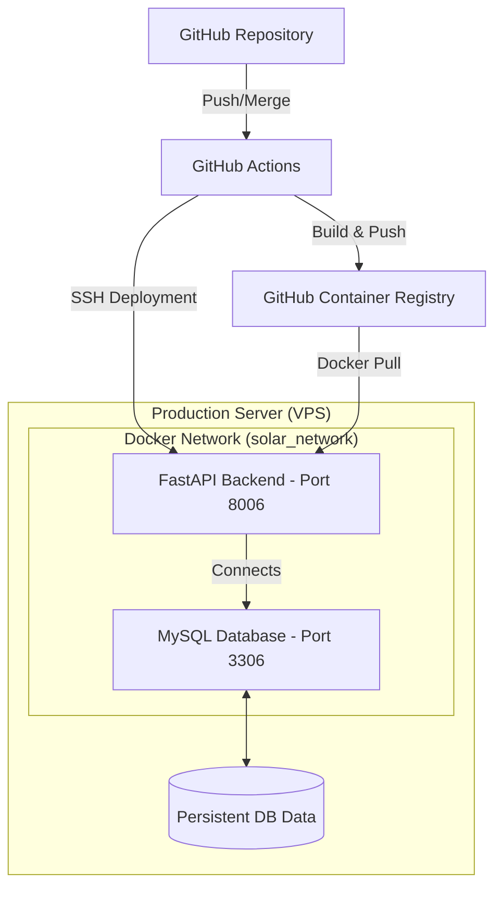

# SolarDashBoard - Deployment Guide

This guide provides step-by-step instructions for deploying the SolarDashBoard application using Docker and GitHub Actions.

## Table of Contents
1. [Prerequisites](#prerequisites)
2. [GitHub Secrets Configuration](#github-secrets-configuration)
3. [Deployment Architecture](#deployment-architecture)
4. [Automatic Deployment](#automatic-deployment)
5. [Manual Deployment](#manual-deployment)
6. [Monitoring & Maintenance](#monitoring--maintenance)

---

## Prerequisites

### Server Requirements (Hostinger VPS)
- **OS**: Ubuntu 20.04+
- **Docker**: Installed and running
- **Docker Compose**: V2+
- **SSH access**: With root or sudo permissions

### GitHub Repository
- Repository with GitHub Actions enabled
- SSH access credentials for your server

---

## GitHub Secrets Configuration

To enable automated deployment, you must configure the following secrets in your GitHub repository:

**Path**: `Settings` -> `Secrets and variables` -> `Actions` -> `New repository secret`

### SSH Credentials
| Secret Name | Description | Example Value |
|-------------|-------------|---------------|
| `SSH_HOST` | IP Address of your VPS | `123.456.78.90` |
| `SSH_USERNAME` | SSH User (usually root) | `root` |
| `SSH_PASSWORD` | SSH Password for your VPS | `your_vps_password` |

### Database Credentials
| Secret Name | Description | Example Value |
|-------------|-------------|---------------|
| `DB_HOST` | Hostname of the DB service | `db` (Must be `db` for Docker) |
| `DB_PORT` | Database Port | `3306` |
| `DB_USER` | Database Username | `solar_user` |
| `DB_PASSWORD` | Database Password | `secure_password` |
| `DB_NAME` | Database Name | `solar_db` |

---

## Deployment Architecture



---

## Automatic Deployment

### 1. Code-based Deployment
Every push to the `main` or `master` branch triggers an automated deployment of the backend.
```bash
git add .
git commit -m "feat: your changes"
git push origin main
```

### 2. Version Releases (Tags)
Pushing a version tag (e.g., `v1.0.0`) triggers both a backend deployment and the generation of Flutter artifacts (Android APK, Windows EXE, iOS app).
```bash
git tag v1.0.0
git push origin v1.0.0
```

---

## Manual Deployment

If you need to deploy manually or troubleshoot, run these commands on your server:

```bash
# 1. Access the deployment directory
cd /root/solardashboard

# 2. Pull the latest images manually
docker compose pull

# 3. Restart the stack
docker compose down
docker compose up -d

# 4. Verify status
docker compose ps
```

---

## Monitoring & Maintenance

### Check Container Logs
```bash
# View backend logs
docker compose logs -f backend

# View database logs
docker compose logs -f db
```

### Database Backups
It is recommended to run regular backups of your data:
```bash
docker exec solar_db /usr/bin/mysqldump -u root -p'${DB_PASSWORD}' solar_db > backup_$(date +%F).sql
```

### Resource Management
To clear old Docker images and free up space:
```bash
docker image prune -f
```
